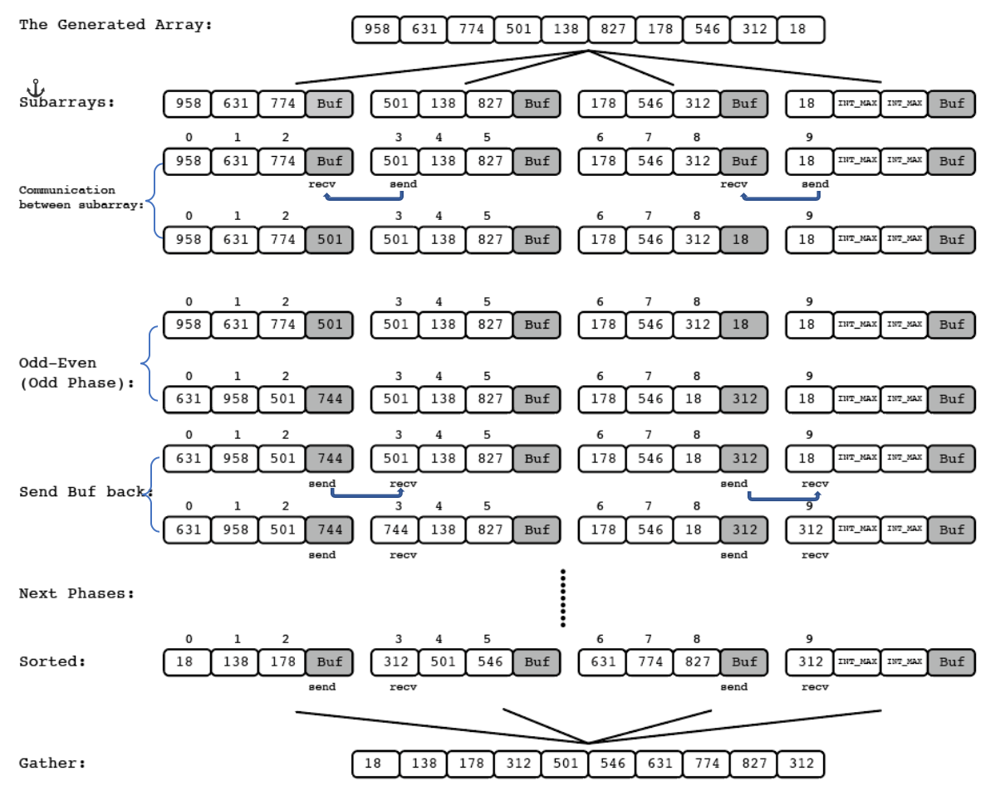

# CSC 4005 Assignment 1 Report

<center>ZHANG, Brando</center>

<center>116******</center>

### Object

​       /* Initially,  *m* numbers are distributed to *m* processes,  respectively.*/

1. For each process with odd rank *P*, send its number to the process with rank *P*-1.
2. For each process with rank *P*-1, compare its number with the number sent by the process with rank *P* and send the larger one back to the process with rank *P*.
3. For each process with even rank *Q*, send its number to the process with rank *Q*-1.
4. For each process with rank *Q*-1, compare its number with the number sent by the process with rank *Q* and send the larger one back to the process with rank *Q*.
5. Repeat 1-4 until the numbers are sorted.

You need to use MPI to design the program. The number of processors used to execute the program is *n* that is much less than *m*.

### Implementation

To solve this problem, the program should figure out the following challenges:

> 1. Generate the original array with given length m to test the performance of this program;
> 2. Partition the original array into N subarrays, where N is the number `mpiexec -n N MPI_odd-even_sort.exe`
> 3. Trace the global index of the first number in each subarray(except the first subarray) and the phase (odd-step or even-step) to decide whether to communicate with its neighbor;
> 4. Check if the array is sorted, if it is, combine all the subarrays to form the sorted array with length equals to the original array. 

#### 1. Approach: Equal-length Partition with Padding



<center>Figure 1: Algorithm</center>

*Figure 1* shows the process of sorting a 10-element array. 

First, the program generates a random array with length 10, and then calculates the number of padding. In this case, 10 elements are divided into 4 parts, so the number of padding is $(4 - (10\%4))\%4=2$, and the padding element is defined as `INT_MAX`, which is the maximum integer in C++. 

Second, the original array will be scattered to each process with equal length. Note that the program allocates one more space for each subarray as a buffer to store the value in MPI communication.

Third, during the communication time, only the numbers which will be compared between subarrays are send to the corresponding subarray's buffer. For example, in odd phase, if and only if the number's index is odd in global index and it is the head of a non-root subarray will send a copy to its previous subarray. (non-root subarrays are those subarray with rank not equal to 0).

Forth, in each subarray, do odd-even sort for one step, then the greater number which will be send to next subarray is placed in the buffer.

Fifth, send the greater number back to the next subarray. One phase done.

Sixth, repeat the above steps for m times (in this case, m equals to 10), the whole array must be sorted, then gather them together to form the sorted array.

### Steps to Execute

Note: the program is tested on Windows 10.

To specify the generated array, open `MPI_odd_even_sort.cpp` with code editor, and change the following value:

```C++
/*    Setting of Array generation    */
const int ARRAY_LENGTH = 40;
const int ARRAY_LOWERBOUND = 0;
const int ARRAY_UPPERBOUND = 1000;
```

Save the changes and **compile the program**, then use the following command to execute:

```powershell
> mpiexec -n N MPI_odd-even_sort.exe
```

where N is the number of processes.

### Result

#### 1. Correctness Test


<center>Figure 2: Sorting an Array of 40 with Integer from 0 to 1000 in 4 Processes</center>

*Figure 2* shows that this program can sort an array of 40 correctly. It reports the copyright information, padding status, generated array, and the sorting result.

#### 2. Performance Test


<center> Figure 3: Execution Time at Different Array Size and Number of Processes (a)</center>

*Figure 3* shows the execution time at different array size (100, 1000, 10,000, 100,000) and number of processes (1, 2, 3, 4, 5, 6, 7, 8). The vertical axis is execution time in second, while the horizontal axis is the number of process. Due to the huge variance between `size 100,000` and others, a detailed version without `size 100,000` is provided below (*Figure 4*). 


<center>Figure 4: Execution Time at Different Array Size and Number of Processes (b)</center>

As *Figure 3* and *Figure 4* shows, the error bars is large when the number of processors is more than 4, which is the amount of physical processors. This is because the extra processes are scheduled by Round Robin Algorithm, the execution time will vary according to the platform status. The trend of execution time is affected by the computation time, I/O time, scheduling time, and the MPI communication time. 

Meanwhile, since the complexity of odd-even sort is $O(n^2)$, the execution time will increase to 100 times if the problem size increase 10 times. The execution time listed above verifies this theoretic complexity.

### Performance Analysis

#### 1. Speedup

Speedup Factor can be calculated by:
$$
\begin{align}
S(n)&=\frac{Execution\ time\ using\ one\ processor}{Execution\ time\ using\ a\ multiprocessor\ with\ n\ processors}=\frac{t_s}{t_p}
\end{align}
$$


<center>Figure 5: Speedup Factor at Different Array Size and Number of Processes</center>

*Figure 5* shows the speedup factors detailedly. The estimation line (dotted) holds only in the program without sequential part, which is unachievable. It is clear that the speedup factor increases as the number of processes increases at `size 100,000`, which works as expected. The reason for the decrease at lower size tests over 4 processes is that these smaller data are held in the extra memory or cache in the multiprocessor system, which optimizes the process speed. When the data size is small, the time-consuming part of MPI Odd-Even Transposition Sort is the communication time among processes rather than computation. Hence, as the number of processes increases, the time of MPI communication increases, which lowers the speedup significantly in smaller size tests.

#### 2. Efficiency

Efficiency gives fraction of time that processors are being used on computation, it can be calculated by:
$$
\begin{align}
E &=\frac{Execution\ time\ using\ one\ processor}{Execution\ time\ using\ a\ multiprocessor\ \times\ number\ of\ processors}\\&=\frac{t_s}{t_p \times n}\\&=\frac{S(n)}{n}\times100\%
\end{align}
$$


<center>Figure 6: Efficiency at Different Array Size and Number of Processes</center>

As expected and discussed above, the processors time are occupied by MPI communication (as test size increases) and scheduling time (as the number of processes increases). Especially when the number of processes increases to 8, which is the amount of the logical processors, the efficiency almost reaches to 0%, which implies that most time are used for MPI communication and processor scheduling.

#### 3. Cost

Cost can be calculated by:
$$
\begin{align}
Cost&=(execution\ time)\times(total\ number\ of \ processors\ used)\\&=\frac{t_sn}{S(n)}\\&=\frac{t_s}{E}
\end{align}
$$


<center>Figure 7: Cost at Different Array Size and Number of Processes</center>

As assumption, the cost with a specific problem size will remain or increase a little bit at different number of processors if the fraction of parallelizable sections is large. In the case of `size 100` and `size 1,000`, the fraction of serial section (i.e. MPI communication and processor scheduling) contributes to the high cost.

### Experience

#### 1. Change Approach due to Limited Available Time

At first, I want to divide the original array into varied length subarrays, i.e. the size of each subarray is different. Since for any integer, the following theorem holds:
$$
ODD + EVEN + ODD=EVEN\\ODD+EVEN+EVEN=ODD
$$
so any given array can be divided into `Rank0` with odd length, `middel_Rank` with even length and the `tail_Rank` with arbitrary length. By applying this approach, the program can confidently send head values in each subarray (except the `Rank0`) at every odd phase since their index in global are all odd. The challenge of implementing this idea is the algorithm of dividing the original array.

My idea is: if the quotient of the original length and the number of processes is even, then move one element from `Rank0` to the `tail_Rank`. If the quotient is odd, then each `middel_Rank` moves one element to `tail_Rank`. 

However, in the case of distributing m numbers into m processes, the length of  `middel_Rank` will become 0. This will cause the MPI communication fails. I try to add condition check to terminate unused processes but fail, so I have to change my approach.

#### 2. Report Parallel Status in Console


<center>Figure 8: Report Parallel Status in Console</center>

In practice, the parallel section does not start from `MPI_Init()` and end at `MPI_Finalize()`. For example, if I add following console output:

```C++
    printf("Test Initialize\n");
    MPI_Init(&argc, &argv);
```

and

```C++
    MPI_Finalize();
    printf("Test Finalized.\n");
```

As shown in *Figure 8*, these statements are displayed for 4 times, which implies that the parallel section starts from the very beginning of the program and ends with `main()` terminates. To report the opyright information, padding status, generated array, and the sorting result, I place these output commands only in `Rank0` by coding:

```C++
const int ROOT = 0;
...
    if(rank == ROOT) {
        ...
        /* REPORT HERE */
        ...
    }
```

However, as for the status in each process, they are owned by each process itself, `Rank0` can report them if and only if `Rank0` get these resources from other processes at first, which is time consuming. So I just let each process reports its own status, but it does not display in a specific order due to the running time variance. 

### Conclusion

This assignment gives a good practice of parallel programming with MPI. `MPI_Send()` and `MPI_Recv()` are blocking communication methods. The advantage of blocking communication is that it reduces the chance of dead lock. However, blocking communication will occupy the CPU time, which leads to low performance in small problem size tasks. This report reveals the characteristic of MPI by providing detailed and insightful analysis.

### Reference

D.(n.d.). MPI Functions - Message Passing Interface. Retrieved from 

​    https://docs.microsoft.com/en-us/message-passing-interface/mpi-functions

### Appendix

#### A. Platform Spec

| Item   | Information                                                 |
| ------ | ----------------------------------------------------------- |
| System | Windows 10 Home Chinese Version                             |
| CPU    | Intel(R) Core(TM) i7-7700 CPU @ 3.60GHz (4 Cores 8 Threads) |
| RAM    | 8.00 GB                                                     |
| Disk   | 1 TB HDD                                                    |

<center>Table 1: Platform specification</center>
