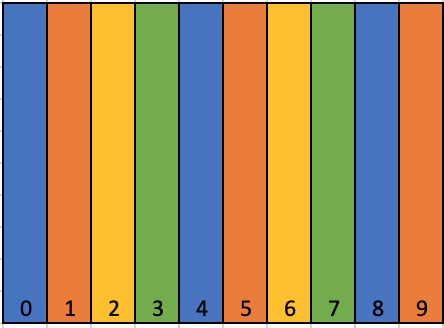
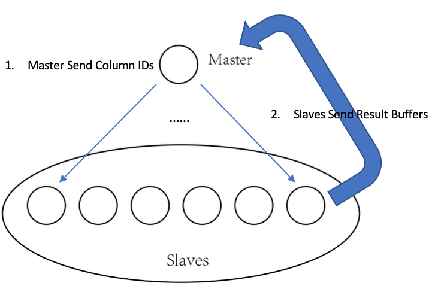
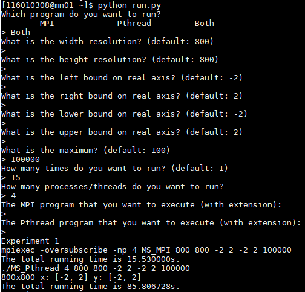
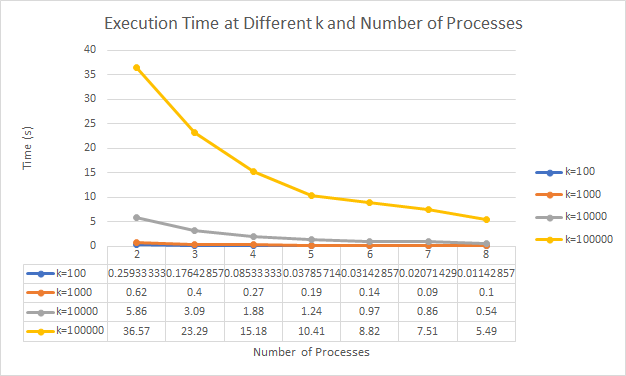
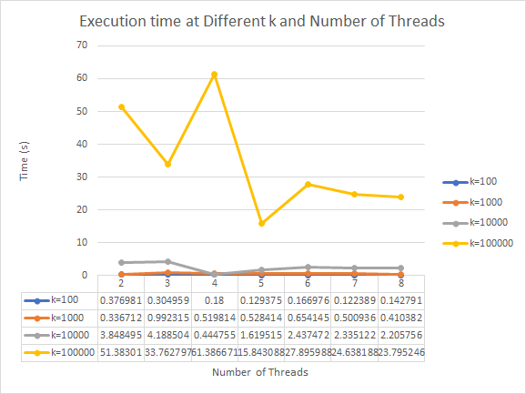
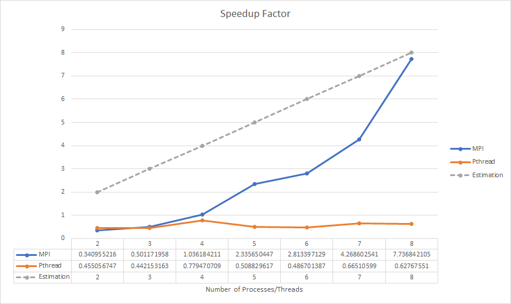

# CSC 4005 Assignment 2 Report

<center>ZHANG, Brando</center>

<center>116******</center>

### Object

Download the sequential Mandelbrot program from http://www.cs.nthu.edu.tw/~ychung/homework/para_programming/seq_mandelbrot_c.htm and compile and run the program based on your machine setting of Xlib (This program uses Xlib calls for the graphics. It is necessary to link the appropriate libraries.) Write the parallel version of the program using MPI and Pthread.


### Implementation

To solve this problem, the program should figure out the following challenges:

> 1. The way to assign work. In this case, the work corresponding to the `number of pixels` or the `MAX_CALCULATE_TIME` that one process / thread need to calculate;
> 2. Synchronize the status among processes or threads through message passing or shared memory;
> 3. Measure the execution time and get the running log for analysis.


To perform several experiments efficiently, I design a Python script to run programs for specific times and it can pass computing preferences with a user friendly interface (see *Appendix B*). Besides, I add the following codes so that each program can output its execution log automatically:


```c
	/* save execution time log in Pthread version */
	FILE *log_file_p;
	char file_name[100];
	sprintf(file_name, "Pthread_%d_threads_in_%dx%d_img_to_%d_execution_time.txt", NUM_PTHREADS, X_RESN, Y_RESN, MAX_CALCULATE_TIME);
	log_file_p = fopen(file_name, "a");
	fprintf(log_file_p, "%f\n", total_time);
	fclose(log_file_p);
```


Note that `NUM_PTHREADS` or `NUM_PROCESSES` is the number of workers, and `X_RESN` and `Y_RESN` are the resolution on x direction and y direction respectively, while `MAX_CALCULATE_TIME` is the threshold of stopping the computation on one pixel. 


#### 1. Approach 1: Static Assignment

Static Assignment means the work of each process/thread is fixed when the program starts, i.e. each process/thread "knows" which work to do after the current work. This experiment implements static scheduling with Pthread since it is a shared memory hierarchy. Basically, to balance the workload as much as possible in static assignment, each thread is responsible for different columns with an offset of `NUM_PTHREADS-1`.



<center>Figure 1: Static Assign 10 Column to 4 Pthreads</center>

As shown in *Figure 1*, to assign 10 columns to 4 pthreads, `pthread_0` should calculate the Mandelbrot value in `column_0`, `column_4`, and `column_8`, and `pthread_1` should calculate that in `column_1`, `column_5`, and `column_9` and so on so forth (that is, column with the same color will be assigned to the same thread).

Since Pthread is shared memory, the program sets the X11 stuff as the global variable so that every thread computes its own work and then draws on the display. When a thread draws a single point, it locks the display with a `pthread_mutex` so that threads will not access to the shared data concurrently. Moreover, the timestamps also can be set as the shared data so that there will not be duplicated measurement in execution time (see *Experience 2*).


#### 2. Approach 2: Dynamic Assignment

Dynamic Assignment means that the work is assigned to a process/thread if and only if it finishes its previous work, i.e., the faster a worker finishes its work, the more work will be assigned to it, which leads to a dynamic process, and the workload is balanced by this approach for every worker. This experiment implements dynamic assignment with Master-Slaves Model through MPI since it is convenient.



<center>Figure 2: Dynamic Assignment (Master-Slaves Model)</center>

As shown in *Figure 2*, the program should be run with at least 2 processes. One is called `Master` while the others are `Slaves`.

First, the `Master` assigns the first `NUM_PROCESSES-1` columns to each slaves and wait for the result.

Second, `Slave` computes the value on each pixel according to the `column_id` it received, and then send it back to the `Master`.

Third, once the `Master` received the result from a `Slave`, it immediately assigns a new `column_id` to the sender, and the above steps will repeat until all the processes finish their work.


### Steps to Execute

Note: the program is tested on the cluster with python 3.7 (Anaconda).

Before you run MPI program, you should load the module:

```bash
$ module load openmpi-3.1.2-gcc-8.2.0-qgxgzyn
```

Then, copy script `python.py` to the directory of your programs. For example, my directory looks like:

```bash
.
├── MPI_mandelbrot_set.c
├── Pthread_mandelbrot_set.c
├── run.py
└── seq_mandelbrot.c
```

In cluster's terminal, run the command:

```bash
$ python run.py
```

Following is an example of how to specify the parameters:



<center>Figure 3: Example of Running Programs with Python Script</center>


### Result

#### 1. Correctness Test


<center>Figure 4: Draw the Image According to Each Pixel's Calculating Times </center>

*Figure 4* shows the Mandelbrot Set centered at (0, 0) within range $[-2-2i,\ 2+2i]$.


<center>Figure 5: Detail in Mandelbrot Set</center>

*Figure 4* shows the Mandelbrot Set within range $[0.3-0.1i,\ 0.4+0.1i]$.


#### 2. Performance Test



<center>Figure 6: Execution time at Different k and Number of Processes (MPI)</center>




<center>Figure 7: Execution time at Different k and Number of Threads (Pthread)</center>


### Performance Analysis

#### Speedup

Speedup Factor can be calculated by:
$$
\begin{align}
S(n)&=\frac{Execution\ time\ using\ one\ processor}{Execution\ time\ using\ a\ multiprocessor\ with\ n\ processors}=\frac{t_s}{t_p}
\end{align}
$$




<center>Figure 8: Speedup Factor of MPI and Pthread</center>

As shown in *Figure 8*,  this experiment is test on $800\times800$ image with $k=100$. The estimation line (dotted) holds only in the program without sequential part, which is unachievable. It is clear that the speedup factor increases as the number of processes increases, which is expected. The unexpected result shown in Pthread version is that is uses static assignment approach, and one thread may blocking others while it is drawing.

Due to the time limited, I did not implement Pthread dynamic version and did load balanced analysis, but you can check my collected data in the achieve.


### Experience

#### 1. Challenge the original sequential program

There are lots of redundant codes in the original sequential program, and some of the variables are used mistakenly. For example:

```C
	for (i = 0; i < X_RESN; i++)
		for (j = 0; j < Y_RESN; j++)
            ...
            XDrawPoint(display, win, gc, j, i);
```

Actually, i is the `row_index` while j is the `column_index`, so `X_RESN` and `Y_RESN` is confusing.

At first I was not dare to doubt this program since it is provided by our teacher. But after serious checking I found that its coding style is not that good (it is likely that our teacher got it from somewhere else) so I modified the codes a little bit in my programs for better readability.


#### 2. Get familiar with the procedure of running parallel programs on cluster

In this experiment, I get familiar with the procedure of login to the cluster and upload my programs. What’s more, I design a Python script to simplify the experiment and share it with classmates. In the Pthread version, I found that the execution time cannot be measured by `clock()` since it will make duplicated measurement in execution time, we should us `clock_gettime(CLOCK_MONOTONIC, &start)` instead.


### Conclusion

This assignment gives a good practice of parallel programming with MPI and Pthread. MPI is good for message passing so it is easy to implement Master-Slaves Model. Pthread is good for shared memory so it is easy to implement static assignment. Both MPI (dynamic assignment) and Pthread (static assignemt) shows its speedup than sequential program. This report reveals the characteristic of MPI and Pthread by providing detailed and insightful analysis.

 

### Reference

D.(n.d.). MPI Functions - Message Passing Interface. Retrieved from 

​	https://docs.microsoft.com/en-us/message-passing-interface/mpi-functions


### Appendix

#### A. Platform Spec

| Item   | Information                                   |
| ------ | --------------------------------------------- |
| System | GNU/Linux mn01 3.10.0-327.el7.x86_64          |
| CPU    | 4  Intel Xeon E312xx (Sandy Bridge) @ 2.2 GHz |
| RAM    | 8.00 GB                                       |
| Disk   | 250 GB                                        |

<center>Table 1: Platform specification</center>


