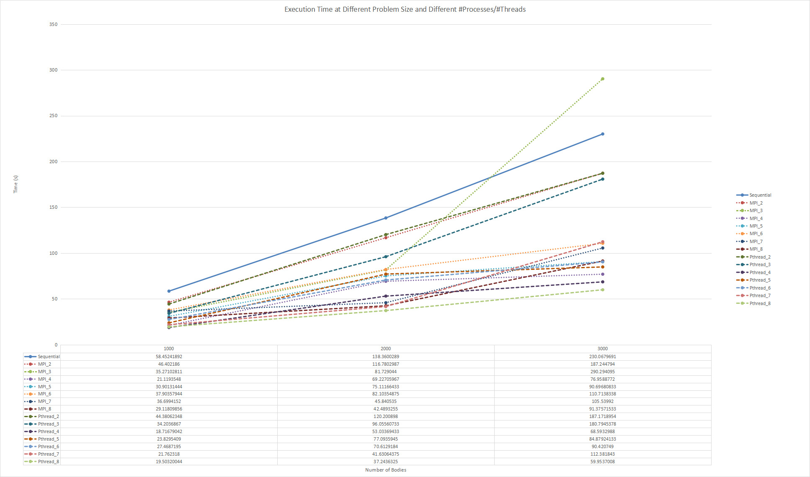

# CSC 4005 Assignment 3 Report

<center>ZHANG, Brando</center>

<center>116******</center>

### Object

Write a sequential program, a P-thread, and MPI-based parallel programs to simulate an astronomical N-body system, but in two-dimensions.  The bodies are initially at rest.  Their initial positions and masses are to be selected randomly (using a random number generator).  Display the movement of the bodies using Xlib, or other GUI systems.


### Implementation

#### 1. Basic Physics Engine

This N-body simulation is a two dimension simulation of a dynamical system of particles under the influence of gravity. Each body is considered as a particle (**which implies it does not have size**) with given mass. All the vectors are decomposed into 2 components along x direction or y direction to simplify the computation, i.e. $\vec {Force} = \vec {Force_x} + \vec {Force_y}$, $\vec {Velocity} = \vec {Velocity_x} + \vec {Velocity_y}$, $\vec {Position} = \vec {Position_x} + \vec {Position_y}$.

For two bodies with mass $M_1, M_2$ respectively, the gravity can be calculated by:
$$
\begin{align}
\vec F &= \frac{G \times M_1 \times M_2}{r^2}\\
\vec {F_x}&= \frac{G \times M_1 \times M_2 \times(\vec{Position1_x}-\vec{Position2_x})}{r^3}\\
\vec {F_y}&= \frac{G \times M_1 \times M_2 \times(\vec{Position1_y}-\vec{Position2_y})}{r^3}
\end{align}
$$
where $G$ is the gravitation constant, $\vec{Position1}$ is the position of $Body_1$, $\vec {Position2}$ is the position of $Body2$, and $r$ is the distance between $Body_1$ and $Body_2$.

Then the velocity of a body can be updated by:
$$
\begin{align}
\vec V_{t+1} &= \vec V_{t} + \frac {\triangle t \cdot \vec F}{M}
\end{align}
$$
where $\vec V_{t+1}$ is the current velocity, $\vec V_t$ is the previous velocity, and $\triangle t$ is the time interval between two steps.

Eventually, each body's position is updated by:
$$
\vec {Position_{t+1}} = \vec {Position_{t}}\ +\triangle t \cdot \vec V_{t+1} 
$$
where $\vec {Position_{t+1}}$ is the current position, $\vec {Position_t}$ is the previous position.

Hence, a data structure called `Body` is constructed with attributes `mass`, `position` and `velocity`(see *Appendix B utils.h*).


#### 2. Approach: Barnes-Hut Algorithm

The straight forward way to do N-Body simulation is to calculate the force between every two bodies, then update the net force of each body to trace the current position. This method will run in $O(N^2)$.

A better strategy is to do approximation if bodies are distant. 


<center>Figure 1: Approximation for Distant Bodies. Retrieved from slides-04, p. 41.</center>

As shown in *Figure 1*, if one body is distant from a cluster of bodies, then this cluster of bodies can be approximated as a single distant body of the total mass of the cluster sited at the center of mass of the cluster. One way to choose cluster is to divide the space into four quadrants recursively. If there exist only one body in the subspace, this divide procedure stops, which results in a quad-tree structure.


<center>Figure 2: Divide Space Into Quadrants Recursively. Retrieved from Ventimiglia, T., & Wayne, K. (n.d.)</center>


<center>Figure 3: Quad-Tree in N-Body Simulation. Retrieved from Ventimiglia, T., & Wayne, K. (n.d.)</center>

In the constructed quad-tree, the topmost node (`root node`) represents the whole space, and its four children represent the four quadrants of the space. Each external node (`leaf node`) represents a single body. Each internal node (`non-leaf node`) represents the group of bodies beneath it, and stores the center-of-mass and the total mass of all its children bodies. *Figure 3* is an example with 8 bodies.

To calculate the net force on a particular body, traverse the nodes of the tree, starting from the root. If the center-of-mass of an internal node is sufficiently far from the body, approximate the bodies contained in that part of the tree as a single body, whose position is the group’s center of mass and whose mass is the group’s total mass. Otherwise, recursively traverse each of its subtrees. 

To determine if a node is sufficiently far away, compute the quotient $\frac{d}{r}$, where $d$ is the width of the region represented by the internal node, and $ r$ is the distance between the body and the node’s center-of-mass. Then, compare this ratio against a threshold value θ. If $\frac{d}{r} \ge \theta$, then the internal node is sufficiently far away. By adjusting the θ parameter, we can change the speed and accuracy of the simulation. Here this program uses $θ = 0.5$, a value commonly used in practice. Note that if θ = 0, then no internal node is treated as a single body, and the algorithm degenerates to brute force.


#### 3. Sequential Program

The sequential program just reconstruct a quad-tree in each step, then travel through this tree to do approximation. If a non-leaf quad-tree node is sufficient away from a body, then use this node to do Gravity Calculation.


#### 4. Parallel Program

##### 4.1 MPI Version

The difference between MPI version and Sequential version is that it uses a `MPI_BCast()` to synchronize the data and divide the computation with `NUM_PROCESSES` processes.


##### 4.2 Pthread Program

The differences between Pthread version and Sequential version is that it assigns computation to each slaves threads and do synchronization in `main()`.


### Steps to Execute

Note: the program is tested on the cluster with python 3.7 (Anaconda).

Before you run MPI program, you should load the module:

```bash
$ module load openmpi-3.1.2-gcc-8.2.0-qgxgzyn
```

Then, copy script `python.py` to the directory of your programs. For example, my directory looks like:

```bash
.
├── MPI_N_Body.c
├── Pthread_N_Body.c
├── Sequential_N_Body.c
├── compile.py
├── run.py
├── utils.c
└── utils.h
```

In cluster's terminal, run the following command to compile:

```bash
$ python compile.py
```

Then, run the following command to test executable programs:

```bash
$ python run.py
```

Alternatively, programs can be compiled or tested manually:

```bash
/* compile */
gcc -o NB_Seq Sequential_N_Body.c utils.c -lm -lX11  // compile sequential program
mpicc -o NB_MPI MPI_N_Body.c utils.c -lm -lX11  // compile MPI program
gcc -o NB_Pthread Pthread_N_Body.c utils -lm -lpthread -lX11  // compile Pthread program

/* test */
// Format: ./NB_Seq X_RESN Y_RESN N MAX_STEP X11_ENABLE
./NB_Seq 800 800 10000 2000 1  // run sequential 10000 bodies simulation in 800x800 space within 2000 steps via X11 display

// Format: mpiexec -oversubscribe -np NUM_PROCESSES NB_MPI X_RESN Y_RESN N MAX_STEP X11_ENABLE
mpiexec -oversubscribe -np 4 NB_MPI 300 200 500 50000 0  // run 4 processes MPI 500 bodies simulation in 300x200 space within 500 steps without display

//Format: ./NB_Pthread NUM_THREADS X_RESN Y_RESN N MAX_STEP X11_ENABLE
./NB_Pthread 10 800 800 500 2000 0  // run 10 threads Pthread 500 bodies simulation in 800x800 space within 2000 steps without display
```

An example of the usage can be shown as following:


<center>Figure 4: Sample Test</center>

Note that I've set some default parameters so you can just tap return to use the default setting.


### Result

#### 1. Performance Test



<center>Figure 5: Execution Time At Different Problem Size and Different Number of Processes or Number of Threads</center>

*Figure 5* shows the relationship between execution time and number of bodies at different processes/threads, which agrees with $O(NlogN)$ complexity. When the problem size is small but execute the program with a great amount of processes/threads, the speedup is not significant.


### Performance Analysis

#### 1. Speedup

Speedup Factor can be calculated by:
$$
\begin{align}
S(n)&=\frac{Execution\ time\ using\ one\ processor}{Execution\ time\ using\ a\ multiprocessor\ with\ n\ processors}=\frac{t_s}{t_p}
\end{align}
$$


<cente>Figure 6: Speedup Factor at Different Problem Size and Number of Processes</center>


<center>Figure 7: Speedup Factor at Different Problem Size and Number of Threads</center>

*Figure 6 and Figure 7* show the speedup factors detailly. The estimation line (dotted) holds only in the program without sequential part, which is unachievable. 


#### 2. Efficiency 

Efficiency gives fraction of time that processors are being used on computation, it can be calculated by:
$$
\begin{align}
E &=\frac{Execution\ time\ using\ one\ processor}{Execution\ time\ using\ a\ multiprocessor\ \times\ number\ of\ processors}\\&=\frac{t_s}{t_p \times n}\\&=\frac{S(n)}{n}\times100\%
\end{align}
$$


<center>Figure 8: Efficiency at Different Problem Size and Number of Processes</center>


<center>Figure 9: Efficiency at Different Array Size and Number of Threads</center>

As expected and discussed above, the processors time are occupied by MPI communication (as test size increases) and scheduling time (as the number of processes increases). Especially when the number of processes increases to 8, which is the amount of the logical processors, the efficiency declines significantly, which implies that most time are used for MPI communication and processor scheduling. This is similar for Pthread.


### Experience

#### 1. Migrate from C++ to C

At first, I tried to implement these programs in C++ since it is natural to treat `Body`, `Quad-Tree`,  `Force`, `Velocity` and `Position` as object. However, C++ limits to assign temporary address to global variable in shared memory, bringing me troubles on implementing new quad-tree nodes. As I am going to say in *Experience 2*, I changed my approach from maintaining a quad-tree to reconstructing a quad-tree in every step, so I need to build a quad-tree with quad-tree node in `main()` and then update it for slaves to use. However, C++ does not support me to assign the address of new quad-tree node to the global variable, so I have to port my program to C. Worse still, C does not support operator overload, and I have to remove my codes of implementing `vector` class to support the operation of `Force`, `Velocity` and `Position`. In case you are interested, I also provide the original inexecutable C++ program, which in `/deprecated`.


#### 2. Maintain the Quad-tree

Compared with maintaining the Quad-tree structure in the whole simulation, destroying and reconstructing a quad-tree is a wiser choice. In N-Body simulation, different values of physics constant will cause varied motion phenomenons. Even though using some natural physics constants, slingshot effects can also leads a body to travel across several quadrants. These phenomenons consume unnecessary time and memory space to maintain the Quad-tree structure. So eventually I decide to reconstruct a quad-tree in each step.


### Conclusion

This assignment gives a good practice of both sequential programming and parallel programming. The most challenge part of this assignment is the algorithm rather than the parallelism of the program since we are required to implement N-Body simulation from scratch. I changed several approaches in this assignments to test if it works. During the designing, I search for numerous resources to understand the Barnes-Hut Algorithm. Actually, computers cannot simulate N-Body accurately yet because its precision fault. And there is always a trade-off between efficiency and accuracy in computation problems. How to balance the efficiency and accuracy is a kind of art in computer science.

As mentioned in previous assignments, for a given algorithm, the efficiency of Pthread is always better than that of MPI since communication among processes like `MPI_BCast()` consumes more time than the access of shared memory within threads. This report reveals the characteristic of MPI and Pthread by providing detailed and insightful analysis.

 

### Reference

D.(n.d.). MPI Functions - Message Passing Interface. Retrieved from 

​	https://docs.microsoft.com/en-us/message-passing-interface/mpi-functions

Ventimiglia, T., & Wayne, K. (n.d.). The Barnes-Hut Algorithm. Retrieved from 

​	http://arborjs.org/docs/barnes-hut


### Appendix

#### A. Platform Spec

| Item   | Information                                   |
| ------ | --------------------------------------------- |
| System | GNU/Linux mn01 3.10.0-327.el7.x86_64          |
| CPU    | 4  Intel Xeon E312xx (Sandy Bridge) @ 2.2 GHz |
| RAM    | 8.00 GB                                       |
| Disk   | 250 GB                                        |

<center>Table 1: Platform specification</center>


