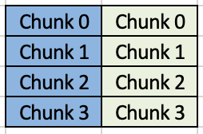

# CSC 4005 Assignment 4 Report

<center>ZHANG, Brando</center>

<center>116******</center>

### Object

*Figure 1* shows a room has  four walls and a fireplace. The temperature of the wall is 20ºC, and the temperature of the fireplace is 100ºC.  Write MPI and Pthread programs using Jacobi iteration to compute the temperature inside the room and plot (preferably in color) temperature contours at 5ºC intervals using Xlib or other GUI systems on your computers in each iteration. 


<center>Figure 1: Room Specification</center>

Here, this experi\ment make some assumption based on the original problem description shown above:

 	1. The temperature of the remaining part of this room, i.e. the inner space, is the same as the walls, i.e. 20ºC;
 	2. The walls are thermostatic, i.e. the temperature of walls will not change during heat distribution simulation;
 	3. To compare the performance in different conditions more equally, I did not set an $\epsilon$ check to terminate the simulation in advanced if the temperature converges.


### Implementation

#### 1. Temperature Calculation

For a square room, the temperature of each point can be calculated by the equation:
$$
h_{i,j} = \frac{h_{i-1,j}+h_{i+1,j}+h_{i,j+1}+h_{i,j-1}}{4}
$$
where $h_{i,j}$ is the interior point at row index `i` and column index `j` with $0\le i<x$ and $0\le j < y$. More specifically, the $h_{i-1,j}, h_{i+1,j}, h_{i,j+1}, h_{i,j-1}$ are actually the temperatures of $h_{i,j}$'s neighbors  in last iteration. This is derived from:


where $x^k_i$ is k-th iteration of $x_i$, $x^{k-1}_j$ is the (k-1)th iteration of $x_j$.

So the program should make a copy of the current room temperature to calculate the room temperature of next iteration.


#### 2. Color Scheme: Modified From China Meteorological Administration

To make the display more intuitive, the program applies a color scheme similar to China Meteorological Administration ==[1]==. The difference is that the program maps its color temperature range [20, 100] to that in China Meteorological Administration in range [-40, 40].

The color scheme is modified in `display.h` like:

```C
	/* create color, refer to China Meteorological Administration */
	int red[20] = { 67, 77, 87, 79, 132, 108, 115, 171, 203, 238, 249, 252, 253, 252, 250, 250, 255, 240, 247, 252 };
	int green[20] = { 73, 102, 117, 151, 185, 198, 225, 247, 251, 253, 250, 242, 227, 200, 166, 146, 121, 93, 79, 38 };
	int blue[20] = { 201, 210, 213, 225, 251, 236, 231, 235, 218, 202, 213, 172, 125, 101, 68, 0, 26, 4, 20, 3 };
	int i;
	for (i = 0; i < 20; i++)
	{
		color[i].red = red[i] * 250;
		color[i].green = green[i] * 250;
		color[i].blue = blue[i] * 250;
		color[i].flags = DoRed | DoGreen | DoBlue;
		XAllocColor(display, default_cmap, &color[i]);
	}
```

Which results the color scheme:


<center>Figure 3: Color Scheme</center>


#### 3. Sequential Program

The sequential program is improved from our teaching assistant. Basically I just change the color scheme and remove some unused parameters there.


#### 4. Parallel Program

This assignment is different from that in Mandelbrot set since the workload of any part with the same size in heat distribution simulation is identical. So there is no need to implement dynamic scheduling. So I come up with the following possible improvement:

  1.  **Make use of symmetric.** The heat distribution simulation in this problem is symmetric with column `y/2`, so the program can just calculate the heat distribution on the left half with one more column (ensure correctness) and then copies corresponding result to the right half. This is applied in both MPI version and Pthread Version;

  2.  **Reduce display frequency.** During the experiments, I found that the execution time occupied by X11 for display is very large. This is because the program has to transfer all the pixels from remote server to client and its influence is greater than the communication time in MPI. So I add the following code to reduce display frequency:

      `const.h`

      ```C
      #define X_REFRESH_RATE 100
      ```

      `ANYPROGRAM.c`

      ```C
      if (X11_ENABLE)
      		{
      			if (iter % X_REFRESH_RATE == 0)
      				XRedraw(tempField, iter);
      		}
      ```

      So I can ignore the influence of display transfer if I pass `0` to `X11_ENABLE` when I am going to run the program. 

  3.  **Partition the room to several chunks.** The whole room is partition into `NUM_PROCESSES` chunks since it applies static assignment. To combine *Approach 1*, the program partition the room horizontally, and each worker only calculate the left half (shown in blue in *Figure 4*)

      

      <center>Figure 4: Work Assignment</center>

  4.  **Terminate simulation in advance if converge.** If the walls and fireplace are thermostatic, then the simulation will approach to a balance status. The tolerant change between two iteration is called $\epsilon $ and the simulation can terminate if the temperature change is less than $\epsilon $. However, this may cause the problem size does not scale as the iteration increases or room size increases, which make it hard to implement Control Variable Method. So the program does not implement this.

  5.  **Scale the room in iteration.** When I did research on the Internet, I found the original author ==[2]== of TA's code and started to tested his program. The original author, Jianfeng CHEN, came up with the idea of `INCREMENT`, which basically scales the room size in the first few iterations for fast computation and then resizes the result to map the whole room. Its accuracy is not that good because the careless computation in the first few iterations will affect the remaining iterations. What's worse, this design contradicts with his design of $\epsilon $ since the temperature change in the beginning is very little.

  6.  **Lazy calculation.** Lazy calculation refers to the tricky design that skipping the computation if one point has 4 neighbors in room temperature. To be honest, when the whole room is above room temperature, all the points will update their temperature in each iteration. So this method does not work efficiently in this problem.

##### 4.1 MPI Version

Except for the improvement stated above (*1, 2* and *3*), `MPI Version` uses `MPI_Allgather()` to scatter the whole field to all processes and gather their computation result to update the whole field. Which can be shown like:


<center>Figure 5: MPI_Allgather, Retrieved from [3]</center>

So each process can get the whole field in each iteration but only calculates its interested chunk. The expected speedup is linear.

##### 4.2 Pthread Program

The differences between `Pthread Version` and `MPI Version` is that Pthread has shared memory so the field update can come into effect to all threads as soon as it does. However, `Pthread Version` has to make use of `mutex` and `pthread_cond` to synchronize the working status of each worker, otherwise the temperature of the field will become inconsistent. 


### Steps to Execute

Note: the program is tested on the cluster with python 3.7 (Anaconda).

Before you compile/run MPI program, you should load the module:

```bash
$ module load openmpi-3.1.2-gcc-8.2.0-qgxgzyn
```

Then, copy script `python.py` to the directory of your programs. For example, my directory looks like:

```bash
.
├── MPI_Heat_Distribution_Simulation.c
├── Pthread_Heat_Distribution_Simulation.c
├── compile.py
├── const.h
├── display.h
├── models.h
├── run.py
└── seq.c
```

In cluster's terminal, run the following command to compile:

```bash
$ python compile.py
```

Then, run the following command to test executable programs:

```bash
$ python run.py
```

Alternatively, programs can be compiled or tested manually:

```bash
/* compile */
gcc -o HDS_Seq seq.c -lm -lX11  // compile sequential program
mpicc -o HDS_MPI MPI_Heat_Distribution_Simulation.c -lm -lX11  // compile MPI program
gcc -o HDS_Pthread Pthread_Heat_Distribution_Simulation.c -lm -lpthread -lX11  // compile Pthread program

/* test */
// Format: ./HDS_Seq x y iteration X11_ENABLE
./HDS_Seq 200 200 10000 1  // run sequential heat distribution simulation in 200x200 space within 10000 steps via X11 display

// Format: mpiexec -oversubscribe -np NUM_PROCESSES HDS_MPI x y MAX_ITERATIONS X11_ENABLE
mpiexec -oversubscribe -np 4 HDS_MPI 300 200 500 0  // run 4 processes MPI heat distribution simulation in 200x300 space within 500 steps without display

//Format: ./HDS_Pthread NUM_PTHREADS x y MAX_ITERATIONS X11_ENABLE
./HDS_Pthread 10 800 800 2000 0  // run 10 threads Pthread heat distribution simulation in 800x800 space within 2000 steps without display
```

An example of the usage can be shown as following:


<center>Figure 6: Sample Test</center>

Note that I've set some default parameters so you can just tap return to use the default setting.


### Result

#### 1. Correctness Check


<center>Figure 7: Temperature Distribution in 300x300 Field</center>

As shown in *Figure 7*, this program works as expected.


#### 2. Performance Test


<center>Figure 8: Execution Time At Different Problem Size and Different Number of Processes or Number of Threads</center>

*Figure 8* shows the relationship between execution time and number of iterations at different processes/threads. When the problem size is small but execute the program with a great amount of processes/threads, the speedup is not significant.


### Performance Analysis

#### 1. Speedup

Speedup Factor can be calculated by:
$$
\begin{align}
S(n)&=\frac{Execution\ time\ using\ one\ processor}{Execution\ time\ using\ a\ multiprocessor\ with\ n\ processors}=\frac{t_s}{t_p}
\end{align}
$$


<center>Figure 9: Speedup Factor at Different Problem Size and Number of Processes</center>


<center>Figure 10: Speedup Factor at Different Problem Size and Number of Threads</center>

*Figure 9 and Figure 10* show the speedup factors detailly. The estimation line (dotted) holds only in the program without sequential part, which is unachievable. It is clear that the speedup factor increases as the number of processes/threads increases, which works as expected. The reason for both the decreases in MPI and Pthreads over 4 workers is the incapacitated problem size, i.e. the problem size is not enough to show the speedup. An evidence for this claim is, at the number of process/threads 4, both MPI and Pthread get speed up in `10000 iterations` or `100000 iterations` than that in `1000 iterations`.


#### 2. Efficiency 

Efficiency gives fraction of time that processors are being used on computation, it can be calculated by:
$$
\begin{align}
E &=\frac{Execution\ time\ using\ one\ processor}{Execution\ time\ using\ a\ multiprocessor\ \times\ number\ of\ processors}\\&=\frac{t_s}{t_p \times n}\\&=\frac{S(n)}{n}\times100\%
\end{align}
$$


<center>Figure 11: Efficiency at Different Problem Size and Number of Processes</center>


<center>Figure 12: Efficiency at Different Problem Size and Number of Threads</center>

As expected and discussed above, the processors time are occupied by MPI communication (as test size increases) and scheduling time (as the number of processes increases). Especially when the number of processes increases to 6, which is the amount of the logical processors, the efficiency declines significantly, which implies that most time are used for MPI communication and processor scheduling. This is similar for Pthread. When the number of threads increases, the workload for each thread decreases, and the possibility for a thread denied by a critical section from other threads increases.


#### 3. Cost

Cost can be calculated by:
$$
\begin{align}
Cost&=(execution\ time)\times(total\ number\ of \ processors\ used)\\&=\frac{t_sn}{S(n)}\\&=\frac{t_s}{E}
\end{align}
$$


<center>Figure 13: Cost at Different Problem Size and Number of Processes</center>


<center>Figure 14: Cost at Different Problem Size and Number of Threads</center>

As assumption, the cost with a specific problem size will remain or increase a little bit at different number of processors/threads if the fraction of parallelizable sections is large. In the case of `MPI_Iteration_100000` and `Pthread_Iteration_100000`, the fraction of serial section (i.e. MPI communication and processor scheduling, or critical section in Pthread) contributes to the high cost.


### Experience

#### 1. MPI_Allgather a 2D-array

At first I tried to implement an encoding and decoding function for the transformation from 2D-array to 1D-array. The reason why MPI cannot send 2D-array directly is that the 2D-array actually is not contiguous allocated on the memory, and the layout may differ from each machine. One common solution is to define a customized `MPI_Type` for message passing, and declare the contiguous allocation for this 2D-array. However, when I read the head file written by Jianfeng Chen, I realized that he has already declared an attribute called `storage` to allocate the data in `t[][]`, so I can directly pass the address of the 2D-array like the way I pass a 1D-array.

#### 2. Partition workload

When it comes to partition a 2D-array to several sub-2D-arrays, I need to check if the workload is divisible by `NUM_PROCESSES` or `NUM_PTHREADS`. Since the program partitions the filed horizontally, it has to calculate the `chunk_height`:

```C
chunk_height = x % NUM_PROCESSES == 0 ? x / NUM_PROCESSES : x / NUM_PROCESSES + 1;
```

To avoid unnecessary computation, it will make use of `legal()` method to check if the area need computation:

```C
if (legal(i, x))
```

Although it works fine in `Pthread Version`, it fails in `MPI Version` since it initializes the field with size $x\times y$ instead of $chunk\_height \times NUM\_PROCESSES$, and the `MPI_Allgather` will then try to access an illegal memory address. This is fixed by just initialize a larger field like:

```C
	chunk_height = x % NUM_PROCESSES == 0 ? x / NUM_PROCESSES : x / NUM_PROCESSES + 1;  // calculate the workload of each process
	
	newField(field, chunk_height * NUM_PROCESSES, y, 0, 0);
	newField(tempField, chunk_height * NUM_PROCESSES, y, 0, 0);
```


### Conclusion

This assignment gives a good practice of both MPI programming and Pthread Programming. Honestly, this assignment is much easier than previous one. The most challenge part of this assignment is to think the problem thoughtfully, and make a good summary for this wonderful course. I dug out the source code provided by our teaching assistant and test these programs in several cases, and revealed both advantages and disadvantages of the original codes. Later I started to redesign the MPI and Pthread Version. My aim focuses on the display and the acceptable speedup (from my point of view, accuracy is always more important than the efficiency). This report reveals the characteristic of MPI and Pthread by providing detailed and insightful analysis.

 

### Reference

[1] C. (n.d.). Notice on Printing and Distributing the Code of Color Standards
for Meteorological Forecasting and Service Products (Trial). Retrieved 
from 

​	https://wenku.baidu.com/view/27f15d48cf84b9d528ea7ae8.html

[2] CHEN, Jianfeng. *Heat Distribution*. Retrieved from

​	www.github.com/cjf00000/Heat-Distribution

[3] Kendall, Wes. “MPI Scatter, Gather, and Allgather.” *MPI Tutorial*. Retrieved from

​	www.mpitutorial.com/tutorials/mpi-scatter-gather-and-allgather/

### Appendix

#### A. Platform Spec

| Item   | Information                                   |
| ------ | --------------------------------------------- |
| System | GNU/Linux mn01 3.10.0-327.el7.x86_64          |
| CPU    | 4  Intel Xeon E312xx (Sandy Bridge) @ 2.2 GHz |
| RAM    | 8.00 GB                                       |
| Disk   | 250 GB                                        |

<center>Table 1: Platform specification</center>

