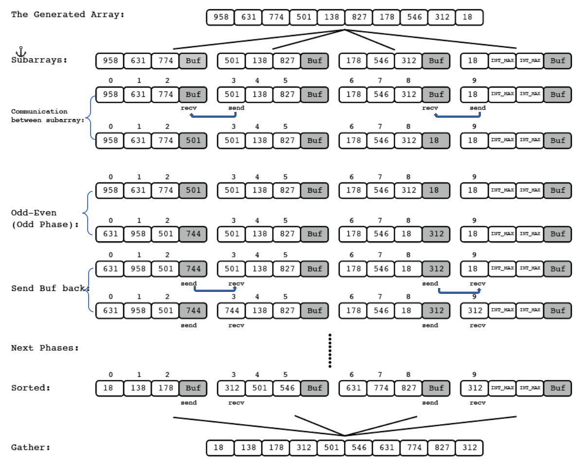
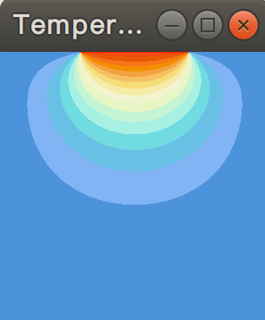

This is an archive of my assignments done in Distributed and Parallel Computing (CSC 4005) in 2018 Fall Term. I publish my work after finishing this course for several reasons:

1. I hope my implementation can inspire someone to come up with a better solution, **but not encourage anyone to directly copy it**. So any *issue* to discuss the implementation is welcome;
2. It is a record of what I've achieved in that semester. I may review some part of the programs in the future;
3. Stars are welcome if it inspired you.

## Overview

1. Parallel Odd-Even Transposition Sort

   

2. Mandelbrot Set Computation

   

   

3. N-Body Simulation

4. Heat Distribution Simulation

   

